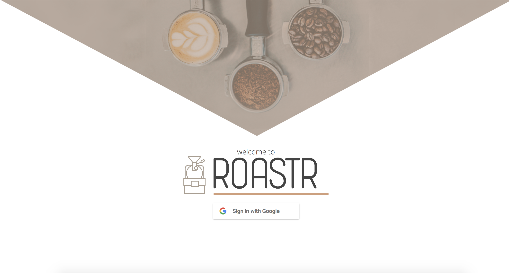
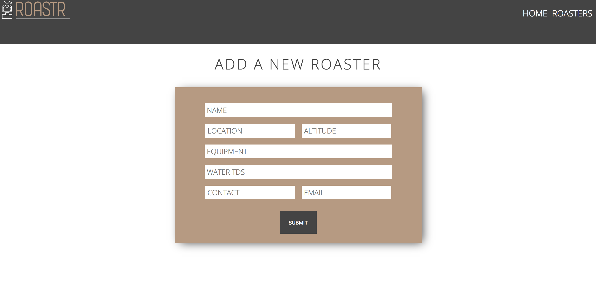

# ROASTR
#### A tool for multi-roaster coffee shops to manage their coffees, and seamlessly communicate with the roasters that send them. It uses the Sendgrid API to send emails between the client and their supplier.  ROASTR was built for and with Amethyst Coffee Shop, and is currently being tested for multiple users.
### Stack:  React JS, Redux, Router, Firebase, Express 

